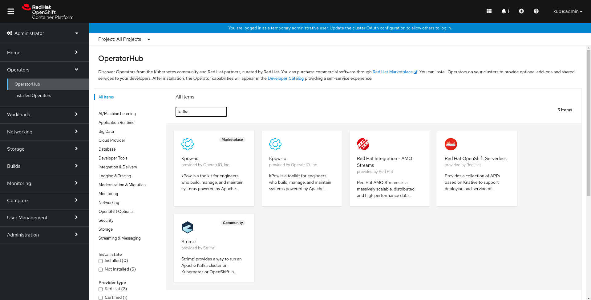
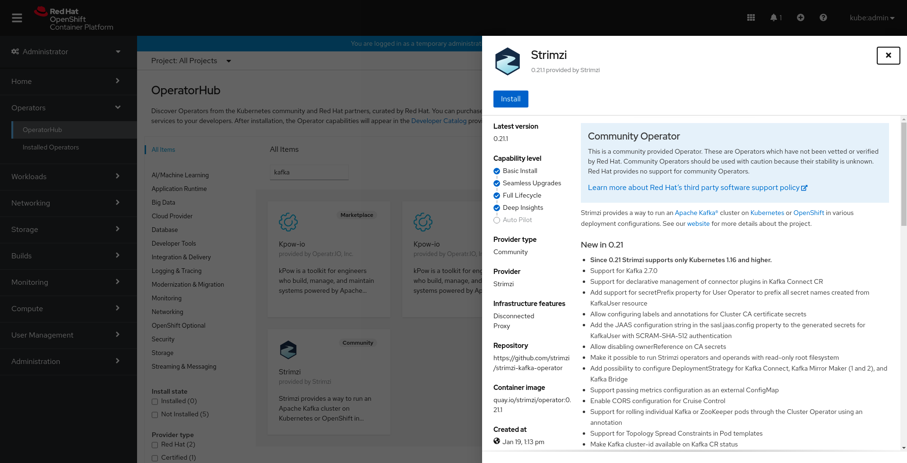
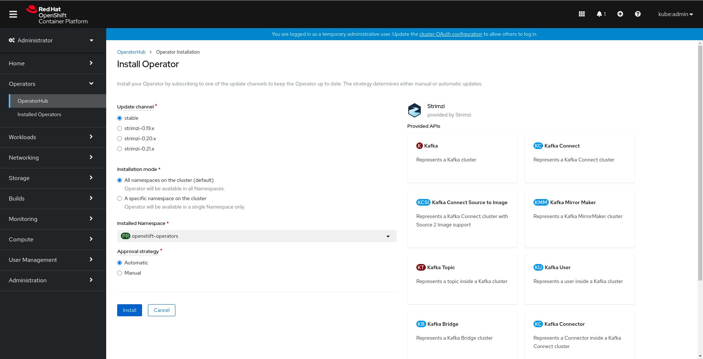
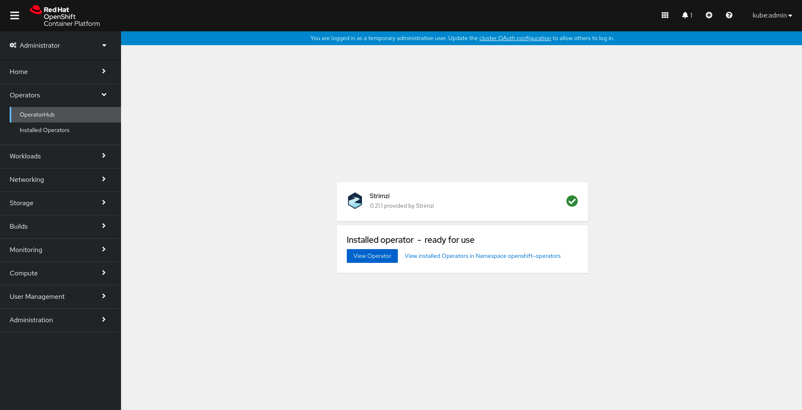
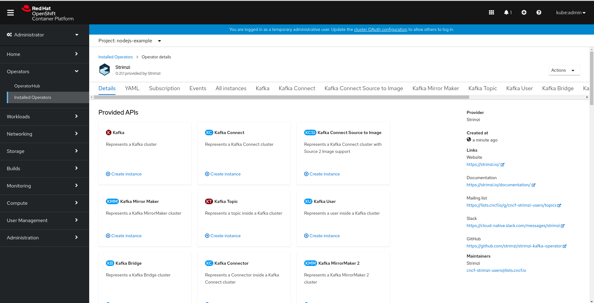
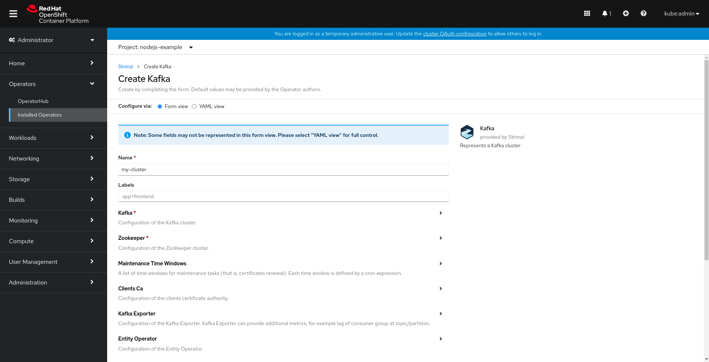
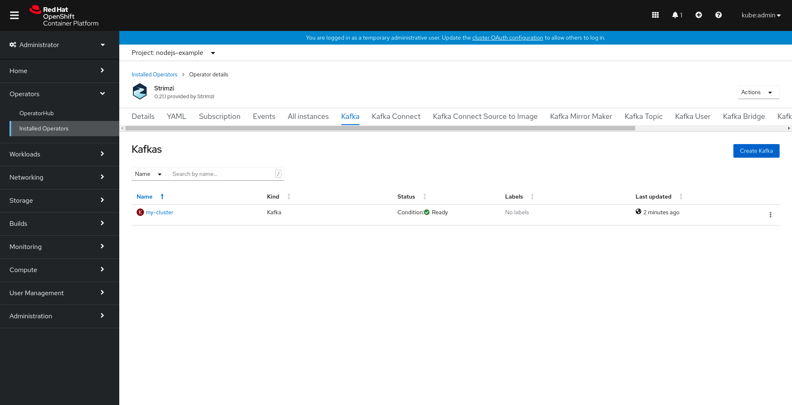
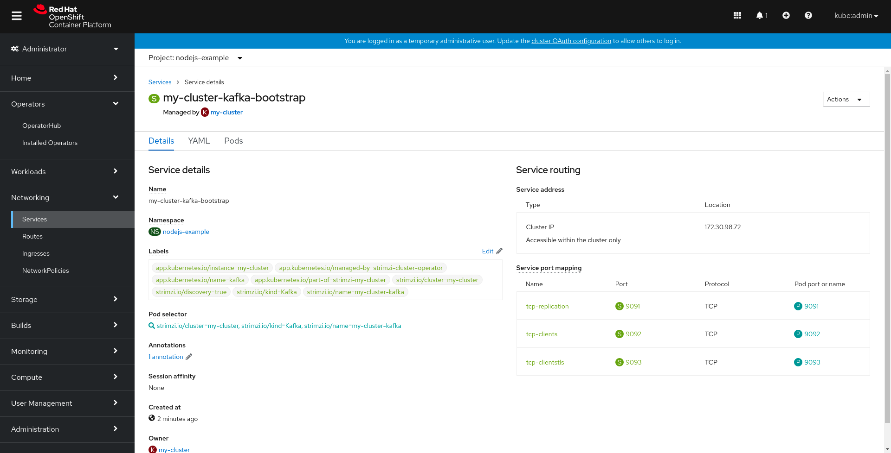

# Kafka Operator Setup

This guide will show how to setup the Kafka Operator on Openshift and creating an instance of a Kafka cluster using the Web Console.

This guide assumes that you have access to an Openshift Cluster with admin rights and are in the Web Console

## Install the Operator.

To install the Kafka Operator, first navigate to the Operator Hub by clicking on the link on the left navigation bar.  Type "Kafka" in the search field.

This will return more than one operator, but we want the one that says "Strimzi", which is the community version of Kafka.

Next, just click the install button

Choose the defaults, and again click the install button

It might take a couple minutes to finish installing, but once it does, it should look something like this:

## Create a Cluster

Now that the operator is installed, it is time to create an instance of a Kafka cluster.  Before that happens it is important to switch to the namespace/project that you are deploying your applications to, since we want that cluster instance to be in that namespace.  You can create a new namespace/project either on the command like with `oc new-project` or in the Web Console.

Once you are in the correct namespace/project, navigate to the installed operators screen by clicking the installed operators link on the left navigation.  Then click on the "Kafka Operator" that was just installed.

You should see something like this screen:

Click the "Create instance" link under the Kafka section of the Provided API's

You should see this screen:

Again,  just accept the defaults and click the button at the bottom to create the instance.

Once the cluster is ready, you should see a screen like this:

You can then click into that cluster to see more details about it.  The most important thing to look at is the Service that gets created.  The service name is what we will use in our application to connect to this cluster.

If you used all the defaults, your Service object should look like this:

