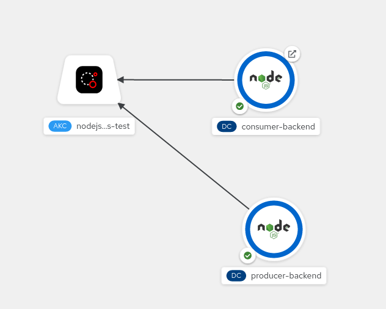

# reactive-example

This is a basic end-to-end app that demonstrates publishing and subscribing to Kafka.

While it's possible to write the consumer and producer in a single node.js project for demonstration purposes, we've decided to split it into three parts (not in monorepo form) to take advantage of the microservices architecture and deployment in OpenShift to get closer to the four principles of reactive systems described in the
[reactive manifesto](https://www.reactivemanifesto.org/).

Also a good suggestion to read item `5. Reactive programming != Reactive system` of the article [5 Things to Know About Reactive Programming](https://developers.redhat.com/blog/2017/06/30/5-things-to-know-about-reactive-programming)

The example is composed by:

- A standalone producer app (producer-backend)
- An Express-Websocket server (consumer-backend)
- A front-end app to connect to consumer's Websocket server to display the messages

> The example is intended to be deployed and run in an OpenShift or [CodeReady containers](https://developers.redhat.com/products/codeready-containers/overview) with [Kafka operator](https://strimzi.io/quickstarts/) installed. (Although it is possible to run on a common kafka installation.)

## Setup Kafka Operator

Installing the Kafka Operator using the Web Console of OpenShift is pretty straightforward. A more visual guide is provided [here](./KAFKA_OPERATOR_SETUP.md)

First, go to the _Operator Hub_ and search for _Kafka_. A few choices might show up, but we want the one that says "Strimzi" which is the community Kafka version.

Since we just want the defaults, we can just click _install_ on the next 2 screens. Then wait until the operator is ready.

Next, create a new project. I used nodejs-examples, but it can be anything. This can either be done on the command line with the `oc` client, or in the web console. I tend to do this step in the console.

```
$ oc new-project nodejs-examples
```

The last step of the setup, is to create a new Kafka instance. This can be done from the web console also. Navigate to the installed operators and click on the kafka one that was just installed.

Before clicking on the _Create Instance_ link under the Kafka tab, make sure your "current project namespace" is the one you just created. Once that is set, click the _Create Instance_ link and just use the defaults, which should name the new cluster `my-cluster`

## Environment Variables

Below is a list of all the environment variables, with their default values, that consumer and producer support, in case you want to test locally.

```
# The broker where the client will connect to and send the messages
KAFKA_HOST=my-cluster-kafka-bootstrap:9092

# Client id of the kafka instance
RHOAS_SERVICE_ACCOUNT_CLIENT_ID=

# Client password for the kafka instance
RHOAS_SERVICE_ACCOUNT_CLIENT_SECRET=

# Endpoint url where the kafka client will connect to, for fetching the bearer token in case of sasl mechanism has been set to oauthbearer, otherwhise the value will be ignored and can be empty
RHOAS_TOKEN_ENDPOINT_URL=

# Type of sasl mechanism, valid values are plain or oauthbearer
KAFKA_SASL_MECHANISM=

# The topic where the kafka client will connect to, for consuming and producing messages
KAFKA_TOPIC=topic

# Group id of the consumer
KAFKA_GROUPID=consumer-test

# Id of the kafka client that connects to kafka instance. More info on https://kafka.js.org/docs/configuration#client-id
KAFKA_CLIENT_ID=kafkajs-consumer

```


## Deploy the Applications

Both producer and consumer are using [KafkaJS](https://github.com/tulios/kafkajs).

### producer-backend

The producer-backend is using [KafkaJS](https://github.com/tulios/kafkajs#-usage) to send messages to Kafka, which its content is a random country name.

If you used the defaults for the cluster naming, then nothing needs to change, but if you named the cluster something else, then you will need to change the server name in the code:

```
const kafka = new Kafka({
  brokers: 'my-cluster-kafka-bootstrap:9092'
})
```

### consumer-backend

Similar to the producer backend, the consumer is also using [KafkaJS](https://github.com/tulios/kafkajs#-usage). If you named the cluster something other than `my-cluster` you will need to update the cluster name in the consumer code.

### front-end

The front-end part is a vue app that connects via WebSocket to the consumer back-end.

The example is using [nodeshift](https://github.com/nodeshift/nodeshift) to deploy the apps to OpenShift.

### Running the example

```
cd producer-backend
npm run OpenShift

cd ../consumer-backend
npm run OpenShift

cd ../frontend
npm run OpenShift
```

### node-rdkafka and KafkaJS

node-rdkafka and KafkaJS are two commonly used Kafka clients. The
[Message-Queueing- Kafka](https://github.com/nodeshift/nodejs-reference-architecture/blob/main/docs/functional-components/message-queuing.md)
section in the Node.js reference architecture provides some recommendations on how to choose which client to use.

This repository includes 2 branches, one for each of the clients so that you can use either of the
clients when running the example.

For KafkaJS there are no additional pre-requisites.

### Working with Managed Kafka

Instead of installing a Kafka instance into your cluster you can also
use a managed Kafka instance like
[Red Hat OpenShift Streams for Apache Kafka (RHOSAK)](https://developers.redhat.com/products/red-hat-OpenShift-streams-for-apache-kafka/overview).
If you are deploying into OpenShift and using RHOSAK, the example is all
set up to use service bindings, and to connect your Kafka instance.
Provided you have installed the OpenShift Application Services and
Service Binding Operators and have configured them with your RHOSAK
information you can simply drag the arrow from the producer and consumer
on the OpenShift topology page onto icon for the Kafka instance.



This is possible due to the use of the
[kube-service-bindings](https://github.com/nodeshift/kube-service-bindings)
package. In the code you'll see a call to:

```JavaScript
  kafkaConnectionBindings = serviceBindings.getBinding('KAFKA', 'node-rdkafka');
```

which will get the connection info from the bindings if it is available and
return it in the format required by the Kafka client.

### OpenTelemetry with OpenShift Distributed Tracing Platform

This [link](./OTEL.md) contains instructions on how to install the
OpenShift Distributed Tracing Platform and enable tracing.
